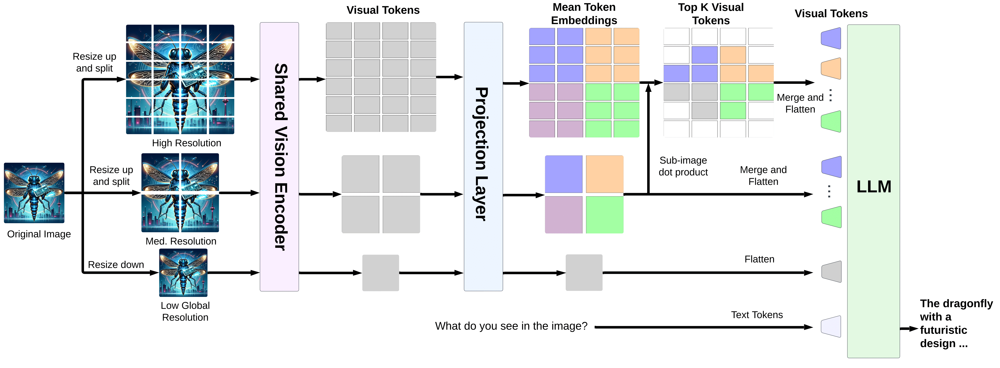
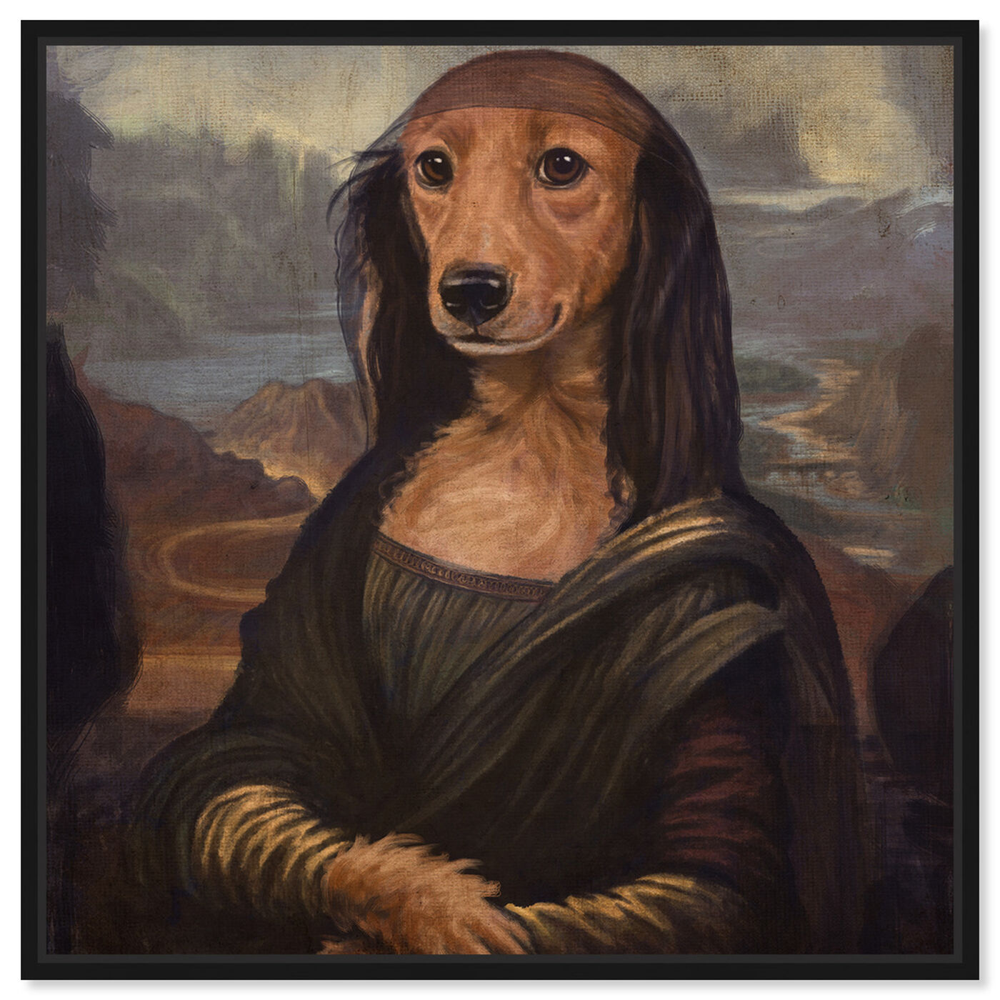

<div align="center">
  
  <h1>Dragonfly: Multi-Resolution Zoom-In Encoding Enhances Vision-Language Models</h1>
</div>

## 🔥 News
- **Note**: We updated our codebase and arxiv paper with improved version of Dragonfly architecture. If you still want to use the old version of the code, it is still in [github branch](https://github.com/togethercomputer/Dragonfly/tree/dragonfly-v1).
- [Our paper](https://arxiv.org/abs/2406.00977) is out on arxiv.
- Our model checkpoints are out on huggingface 🤗 🚀: 
    - General: [`togethercomputer/Llama-3.1-8B-Dragonfly-v2`](https://huggingface.co/togethercomputer/Llama-3.1-8B-Dragonfly-v2) 
    - Biomed: [`togethercomputer/Llama-3.1-8B-Dragonfly-Med-v2`](https://huggingface.co/togethercomputer/Llama-3.1-8B-Dragonfly-Med-v2)


## 📖 Introduction



Recent advances in vision-language models (VLMs) have demonstrated the advantages of processing images at higher resolutions and utilizing multi-crop features to preserve native resolution details. However, despite these improvements, existing vision transformers (ViTs) still struggle to capture fine-grained details from less prominent objects, charts, and embedded text, limiting their effectiveness in certain tasks. In this paper, we go beyond recent high-resolution and multi-crop techniques by not only preserving the native resolution, but zooming in beyond it and extracting features from a large number of image sub-crops. This enhancement allows our model to better capture fine-grained details, overcoming the limitations of current ViTs. To manage the increased token count and computational complexity, we demonstrate that a simple mean-pooling aggregation over tokens is effective. Our model, Dragonfly, achieves competitive performance on general-domain tasks such as ScienceQA and AI2D, and excels in tasks requiring fine-grained image understanding, including TextVQA and ChartQA. Among models in the 7-8B parameter range, Dragonfly consistently ranks at the top across ten general-domain benchmarks, achieving the highest or second-highest scores in most cases, outperforming models that are significantly larger or trained on larger datasets. Our biomedical version, Dragonfly-Med, sets new benchmarks on several medical tasks, achieving 91.6% accuracy on SLAKE (compared to 84.8% for Med-Gemini), 67.1% token F1 score on Path-VQA (compared to 62.7% for Med-PaLM M), and attains state-of-the-art results across the majority of performance metrics. Overall, our work highlights the persistent challenge of engineering visual representations with fixed-resolution ViTs, and proposes a simple yet effective solution to address this issue and boost performance in both general and specialized domains. 


# 📖 Table of Contents
- [📖 Table of Contents](#-table-of-contents)
  - [💿 Installation](#-installation)
  - [🏁 Checkpoint](#-checkpoint)
  - [🧠 Inference](#-inference)
  - [📊 Dataset](#-dataset)
  - [🏋️‍♂️ Training](#️️-training)
    - [Stage 1](#stage-1)
    - [Stage 2](#stage-2)
  - [🏆 Credits](#-credits)
  - [📚 BibTeX](#-bibtex)
  - [🪪 License](#-license)

<a name="installation"/>

## 💿 Installation

Create a conda environment and install necessary packages
```bash
conda env create -f environment.yml
conda activate dragonfly_env
```

Install flash attention
```bash
pip install flash-attn --no-build-isolation
```

As a final step, please run the following command. 
```bash
pip install --upgrade -e .
```

<a name="checkpoint"/>

## 🏁 Checkpoint

*Note: These models are released under [Llama 3.1 Community License Agreement](LICENSE)*

We release two huggingface model checkpoints: [`togethercomputer/Llama-3.1-8B-Dragonfly-v2`](https://huggingface.co/togethercomputer/Llama-3.1-8B-Dragonfly-v2) and [`togethercomputer/Llama-3.1-8B-Dragonfly-Med-v2`](https://huggingface.co/togethercomputer/Llama-3.1-8B-Dragonfly-Med-v2). Please follow the script [`test_dragonfly.py`](test_dragonfly.py) for more details. We provide a brief description on how to use them below.

<a name="inference"/>

## 🧠 Inference

If you have successfully completed the [Installation](#installation) process, then you should be able to follow the steps below. 

We provide two test examples inside [`assets`](assets). 

Question: What is so funny about this image?



Load necessary packages
```python
import torch
from PIL import Image
from transformers import AutoProcessor, AutoTokenizer

from dragonfly.models.modeling_dragonfly import DragonflyForCausalLM
from dragonfly.models.processing_dragonfly import DragonflyProcessor
from pipeline.train.train_utils import random_seed
```

Instantiate the tokenizer, processor, and model. 
```python
device = torch.device("cuda:0")

tokenizer = AutoTokenizer.from_pretrained("togethercomputer/Llama-3.1-8B-Dragonfly-v2")
clip_processor = AutoProcessor.from_pretrained("openai/clip-vit-large-patch14-336")
image_processor = clip_processor.image_processor
processor = DragonflyProcessor(image_processor=image_processor, tokenizer=tokenizer, image_encoding_style="llava-hd")

model = DragonflyForCausalLM.from_pretrained("togethercomputer/Llama-3.1-8B-Dragonfly-v2")
model = model.to(torch.bfloat16)
model = model.to(device)
```

Now, lets load the image and process them.
```python
image = Image.open("./assets/monalisa_dog.jpg")
image = image.convert("RGB")
images = [image]
# images = [None] # if you do not want to pass any images

text_prompt = "<|start_header_id|>user<|end_header_id|>\n\nWhat is so funny about this image?<|eot_id|><|start_header_id|>assistant<|end_header_id|>\n\n"

inputs = processor(text=[text_prompt], images=images, max_length=4096, return_tensors="pt", is_generate=True)
inputs = inputs.to(device)
```

Finally, let us generate the responses from the model
```python
temperature = 0

with torch.inference_mode():
    generation_output = model.generate(**inputs, max_new_tokens=1024, eos_token_id=tokenizer.encode("<|eot_id|>"), do_sample=temperature > 0, temperature=temperature, use_cache=True)

generation_text = processor.batch_decode(generation_output, skip_special_tokens=False)
```

An example response.
```plaintext
The humor in this image comes from the surreal juxtaposition of a dog's face with the body of the Mona Lisa, a famous painting by Leonardo da Vinci. The Mona Lisa is known for her enigmatic smile and is often considered one of the most famous paintings in the world. By combining the dog's face with the body of the Mona Lisa, the artist has created a whimsical and amusing image that plays on the viewer 's expectations and familiarity with the original paintings. The contrast between the dog's natural, expressive features and the serene, mysterious expression of the Mona Lisa creates a humerous effect that is likely to elicit laughter<|eot_id|>
```

<a name="dataset"/>

## 📊 Dataset

We will release it soon on HF hub. 

<a name="training"/>

## 🏋️‍♂️ Training

*Note: This training recipe is specifically for our general domain model.*

We adopt a two-stage training process.

### Stage 1
In this stage, we only train our projection layer, so that the model learns to map the embeddings from the vision encoder into the LLM space.

```bash
sh train_dragonfly_stage1.sh
```

### Stage 2
In this stage, we train our vision encoder, projection layer, and LLM jointly on image and text data.

```bash
sh train_dragonfly_stage2.sh
```

Please ensure to update the paths inside the bash script according to your local file paths.

For both stages, the dataset is formatted in the following manner:

```json
{
  "image_url": "<path_to_image>",
  "conversations": "<text_data_formatted>",
  "source": "<data_source>"
}
```

Conversation format follows standard Llama 3 as follows. 

```plaintext
<|start_header_id|>user<|end_header_id|>

Describe the content in the image.<|eot_id|><|start_header_id|>assistant<|end_header_id|>
```


## 🏆 Credits

We would like to acknowledge the following resources that were instrumental in the development of Dragonfly:

- [Meta Llama 3](https://huggingface.co/meta-llama/Meta-Llama-3-8B): We utilized the Llama 3 model as our foundational language model.
- [CLIP](https://huggingface.co/openai/clip-vit-large-patch14-336): Our vision backbone is CLIP model from OpenAI. 
- Our codebase is built upon the following two codebases:
  - [Otter: A Multi-Modal Model with In-Context Instruction Tuning](https://github.com/Luodian/Otter)
  - [LLaVA-UHD: an LMM Perceiving Any Aspect Ratio and High-Resolution Images](https://github.com/thunlp/LLaVA-UHD)

<a name="bibtex"/>

## 📚 BibTeX

```bibtex
@misc{thapa2024dragonfly,
      title={Dragonfly: Multi-Resolution Zoom-In Encoding Enhances Vision-Language Models}, 
      author={Rahul Thapa and Kezhen Chen and Ian Covert and Rahul Chalamala and Ben Athiwaratkun and Shuaiwen Leon Song and James Zou},
      year={2024},
      eprint={2406.00977},
      archivePrefix={arXiv},
      primaryClass={cs.CV}
}
```
<a name="license"/>

## 🪪 License

[META LLAMA 3](LICENSE)
