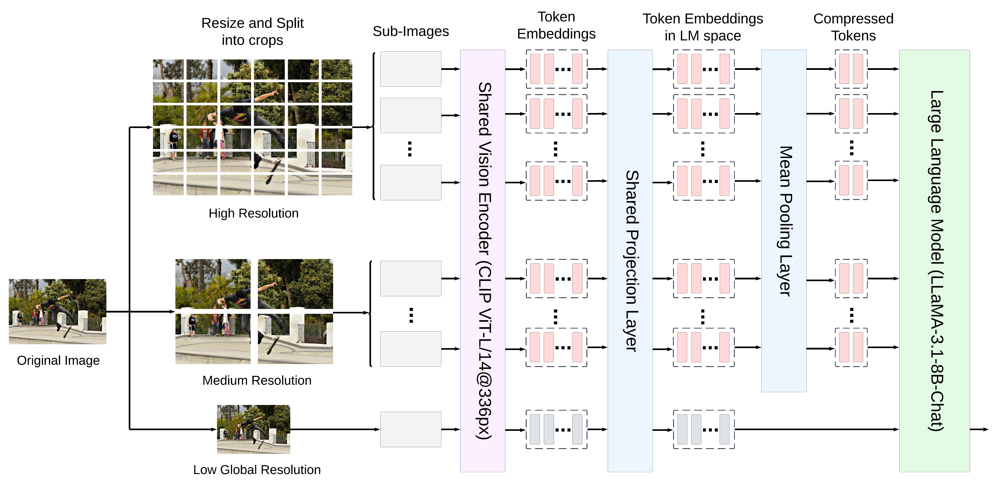

<div align="center">
  
  <h1>Dragonfly: Multi-Resolution Zoom Supercharges Large Visual-Language Model</h1>
</div>

## 🔥 News
- [Our paper](https://arxiv.org/abs/2406.00977) is out on arxiv.
- Check out [our blogpost](todo).
- Our model checkpoints are out on huggingface 🤗 🚀: 
    - General: [`togethercomputer/Llama-3-8B-Dragonfly-v1`](https://huggingface.co/togethercomputer/Llama-3-8B-Dragonfly-v1) 
    - Biomed: [`togethercomputer/Llama-3-8B-Dragonfly-Med-v1`](https://huggingface.co/togethercomputer/Llama-3-8B-Dragonfly-Med-v1)


## 📖 Introduction



Recent advances in large multimodal models (LMMs) suggest that higher image resolution enhances the fine-grained understanding of image details, crucial for tasks such as visual commonsense reasoning and analyzing biomedical images. However, increasing input resolution poses two main challenges: 1) It extends the context length required by the language model, leading to inefficiencies and hitting the model's context limit; 2) It increases the complexity of visual features, necessitating more training data or more complex architecture. We introduce Dragonfly, a new LMM architecture that enhances fine-grained visual understanding and reasoning about image regions to address these challenges. Dragonfly employs two key strategies: multi-resolution visual encoding and zoom-in patch selection. These strategies allow the model to process high-resolution images efficiently while maintaining reasonable context length. Our experiments on eight popular benchmarks demonstrate that Dragonfly achieves competitive or better performance compared to other architectures, highlighting the effectiveness of our design. Additionally, we finetuned Dragonfly on biomedical instructions, achieving state-of-the-art results on multiple biomedical tasks requiring fine-grained visual understanding, including 92.3% accuracy on the Path-VQA dataset (compared to 83.3% for Med-Gemini) and the highest reported results on biomedical image captioning. To support model training, we curated a visual instruction-tuning dataset with 5.5 million image-instruction samples in the general domain and 1.4 million samples in the biomedical domain. We also conducted ablation studies to characterize the impact of various architectural designs and image resolutions, providing insights for future research on visual instruction alignment.


# 📖 Table of Contents
1. [Installation](#installation)
2. [Checkpoint](#checkpoint)
5. [Inference](#inference)
3. [Dataset](#dataset)
4. [Training](#training)
6. [BibTeX](#bibtex)
7. [Licence](#license)


<a name="installation"/>

## 💿 Installation

Clone this repository and navigate to Dragonfly folder
```bash
git clone https://github.com/togethercomputer/Dragonfly.git
cd Dragonfly
```

Create a conda environment and install necessary packages
```bash
conda env create -f environment.yml
conda activate dragonfly_env
```

Install flash attention
```bash
pip install flash-attn --no-build-isolation
```

As a final step, please run the following command. 
```bash
pip install --upgrade -e .
```

<a name="checkpoint"/>

## 🏁 Checkpoint

*Note: These models are released under Creative Commons Attribution Non Commercial 4.0*

We release two huggingface model checkpoints: [`togethercomputer/Llama-3-8B-Dragonfly-v1`](https://huggingface.co/togethercomputer/Llama-3-8B-Dragonfly-v1) and [`togethercomputer/Llama-3-8B-Dragonfly-Med-v1`](https://huggingface.co/togethercomputer/Llama-3-8B-Dragonfly-Med-v1). Please follow the script [`test_dragonfly.py`](test_dragonfly.py) for more details. We provide a brief description on how to use them below.

<a name="inference"/>

## 🧠 Inference

If you have successfully completed the [Installation](#installation) process, then you should be able to follow the steps below. 

We provide two test examples inside [`test_images`](test_images). 

Question: Summarize the visual content of the image.


Load necessary packages
```python
import sys
from dragonfly.models.modeling_dragonfly import *
from dragonfly.models.processing_dragonfly import *
from transformers import AutoProcessor, AutoTokenizer
from PIL import Image
import torch
from pipeline.train.train_utils import random_seed
```

Instantiate the tokenizer, processor, and model. 
```python
tokenizer = AutoTokenizer.from_pretrained("togethercomputer/Llama-3-8B-Dragonfly-v1")
clip_processor = AutoProcessor.from_pretrained('openai/clip-vit-base-patch32')
image_processor = clip_processor.image_processor
processor = DragonflyProcessor(image_processor=image_processor, tokenizer=tokenizer, image_encoding_style='llava-hd')
model = DragonflyForCausalLM.from_pretrained(
    "togethercomputer/Llama-3-8B-Dragonfly-v1"
)
model = model.to(torch.bfloat16)
model = model.to("cuda:0")
```

Now, lets load the image and process them.
```python
image = Image.open("./test_images/skateboard.png")
image = image.convert('RGB')
images = [image]
# images = None # if you do not want to pass any images

text_prompt = "<|start_header_id|>user<|end_header_id|>\n\nSummarize the visual content of the image.<|eot_id|><|start_header_id|>assistant<|end_header_id|>\n\n"
inputs = processor(text=[text_prompt], images=[image], max_length=2048, return_tensors="pt", is_generate=True)
inputs = inputs.to(f"cuda:0")
```

Finally, let us generate the responses from the model
```python
temperature = 0
with torch.inference_mode():
    generation_output = model.generate(**inputs, 
                                        max_new_tokens=1024,
                                        eos_token_id=tokenizer.encode('<|eot_id|>'), 
                                        do_sample=temperature > 0, 
                                        temperature=temperature,
                                        use_cache=True)
generation_text = processor.batch_decode(generation_output, skip_special_tokens=False)
```

An example response.
```plaintext
In the heart of a vibrant skatepark, a skateboarder is caught in a moment of pure exhilaration. The skateboarder, dressed in a black t-shirt adorned with a yellow graphic and black pants, is suspended in mid-air, performing an impressive trick on a concrete ramp. The skateboarder's arms are outstretched, adding balance to the daring stunt.

The skatepark itself is a concrete playground, with the skateboarder's ramp being the main focus. In the background, palm trees sway gently, adding a touch of nature to the urban setting. A few spectators can be seen in the distance, their attention riveted on the airborne skateboarder.

The image captures not just a moment, but a story of skill, courage, and the joy of skateboarding.<|eot_id|>
```

<a name="dataset"/>

## 📊 Dataset

I will release it soon on HF hub. 

<a name="training"/>

## 🏋️‍♂️ Training

*Note: This training recipe is specifically for our general domain model.*

We adopt a two-stage training process.

### Stage 1
In this stage, we only train our projection layer, so that the model learns to map the embeddings from the vision encoder into the LLM space. The dataset mixture used in this stage is `stage1_dataset`, which contains short image and caption pairs.

```bash
sh train_dragonfly_stage1.sh
```

### Stage 2
In this stage, we train our vision encoder, projection layer, and LLM jointly on image and text data. Our training dataset mixture for this stage is provided in `stage2_dataset`. This dataset contains xx.xx% of text-only dataset as well. We also include a math dataset, given in `math_instruct`. 

```bash
sh train_dragonfly_stage2.sh
```

Please ensure to update the paths inside the bash script according to your local file paths.

For both stages, the dataset is formatted in the following manner:

```json
{
  "image_url": "<path_to_image>",
  "conversations": "<text_data_formatted>",
  "source": "<data_source>"
}
```

Conversation format follows standard Llama3 as follows. 

```plaintext
<|start_header_id|>user<|end_header_id|>

Describe the content in the image.<|eot_id|><|start_header_id|>assistant<|end_header_id|>
```


## 🏆 Credits

We would like to acknowledge the following resources that were instrumental in the development of Dragonfly:

- [META LLAMA 3](https://huggingface.co/meta-llama/Meta-Llama-3-8B): We utilized the Llama3 model as our foundational language model.
- Our codebase is built upon the following two codebases:
  - [Otter: A Multi-Modal Model with In-Context Instruction Tuning](https://github.com/Luodian/Otter)
  - [LLaVA-UHD: an LMM Perceiving Any Aspect Ratio and High-Resolution Images](https://github.com/thunlp/LLaVA-UHD)

<a name="bibtex"/>

## 📚 BibTeX

```bibtex
@misc{chen2024dragonfly,
      title={Dragonfly: Multi-Resolution Zoom Supercharges Large Visual-Language Model}, 
      author={Kezhen Chen and Rahul Thapa and Rahul Chalamala and Ben Athiwaratkun and Shuaiwen Leon Song and James Zou},
      year={2024},
      eprint={2406.00977},
      archivePrefix={arXiv},
      primaryClass={cs.CV}
}
```
<a name="license"/>

## 🪪 License

[META LLAMA 3](LICENSE-Meta-Llama3)
